# Ubuntu 24.04 ZFS Mirror Root Installer

Enhanced version of the Ubuntu ZFS mirror root installation script with production fixes and bulletproof first boot.

## Overview

This script creates a ZFS root mirror on two drives for Ubuntu 24.04 Server with full redundancy and automatic failover capability. Both drives will be bootable with UEFI support.

## Features

- **Bulletproof First Boot**: Reliable ZFS pool import without cache file issues
- **Full Drive Redundancy**: Both drives are bootable with automatic failover
- **Production Ready**: Enhanced error handling and recovery mechanisms
- **Automated Cleanup**: Force flags removed automatically after successful first boot
- **UEFI Support**: Modern boot configuration with proper EFI handling

## Requirements

- Ubuntu 24.04 Live USB environment
- Two drives of similar size (±10% tolerance)
- Root privileges
- UEFI boot mode
- Internet connection for package installation

## Quick Start

### 1. Find Your Drives
```bash
ls -la /dev/disk/by-id/ | grep -v part
```

### 2. Basic Installation
```bash
sudo ./zfs_mirror_setup.sh hostname /dev/disk/by-id/drive1 /dev/disk/by-id/drive2
```

### 3. Recommended: Clean Installation
```bash
sudo ./zfs_mirror_setup.sh --prepare hostname /dev/disk/by-id/drive1 /dev/disk/by-id/drive2
```

## Usage Options

```bash
./zfs_mirror_setup.sh [--prepare] <hostname> <disk1> <disk2>
./zfs_mirror_setup.sh --wipe-only <disk1> <disk2>
```

**Options:**
- `--prepare`: Wipe drives completely before installation (recommended)
- `--wipe-only`: Just wipe drives without installing

## Architecture

### ZFS Pool Configuration
- **rpool**: Root filesystem pool with compression and modern features
- **bpool**: Boot pool with GRUB2 compatibility
- **Both pools**: Mirror configuration across both drives
- **Import method**: Scan-based import (`cachefile=none`) for Ubuntu 24.04 reliability

### Partition Layout (per drive)
1. **EFI System Partition**: 1GB FAT32 for UEFI boot
2. **Boot Pool Partition**: 2GB for ZFS boot pool
3. **Root Pool Partition**: Remaining space for ZFS root pool

### System Configuration
- **First Boot Cleanup**: Automatic removal of force import flags
- **Service Configuration**: Bulletproof ZFS import services
- **Recovery Tools**: Manual cleanup utilities included

## Installation Flow

The script follows a carefully orchestrated sequence to ensure reliable ZFS root installation:

```mermaid
flowchart TD
    A[Start Installation] --> B[Validate Drives & Environment]
    B --> C{--prepare flag?}
    C -->|Yes| D[Wipe Drives Completely]
    C -->|No| E[Skip Drive Wipe]
    D --> F[Partition Drives]
    E --> F

    F --> G[Install Required Packages]
    G --> H[Generate Unique Hostid]
    H --> I[Create ZFS Pools]

    I --> J[Boot Pool Creation]
    J --> K[Root Pool Creation]
    K --> L[Verify Empty /mnt for Altroot]
    L --> M[Pools Mount to /mnt]

    M --> N[Synchronize Hostid to Target]
    N --> O[Copy /etc/hostid → /mnt/etc/hostid]
    O --> P[Verify Pool Hostid Alignment]

    P --> Q[Create ZFS Datasets]
    Q --> R[Install Ubuntu Base System]
    R --> S[Configure Target System]

    S --> T[Setup Network & Users]
    T --> U[Install & Configure GRUB]
    U --> V[Generate Initramfs]

    V --> W[Final Hostid Validation]
    W --> X{Hostid Match?}
    X -->|No| Y[❌ FAIL: Hostid Mismatch]
    X -->|Yes| Z[✅ Installation Complete]

    style H fill:#e1f5fe
    style N fill:#e8f5e8
    style O fill:#e8f5e8
    style P fill:#e8f5e8
    style W fill:#fff3e0
    style Z fill:#e8f5e8
    style Y fill:#ffebee
```



### Critical Validation Points

1. **Pre-Pool Hostid Generation** (Step H): Creates unique random hostid for this installation
2. **Post-Pool Hostid Sync** (Steps N-P): Ensures target system matches pool hostid
3. **Final Validation** (Step W): Confirms target system and pools have identical hostids

This sequence prevents "pool was previously in use from another system" errors by ensuring perfect hostid alignment.

## Post-Installation

### Verification Commands
```bash
# Check pool status
zpool status

# Verify both pools imported
zpool list

# Check first boot cleanup
systemctl status zfs-first-boot-cleanup.service
```

### Maintenance Commands
```bash
# Monthly scrub (automated via cron)
sudo zpool scrub rpool && sudo zpool scrub bpool

# Sync EFI partitions
sudo /usr/local/bin/sync-efi-partitions

# Manual force flag removal (if needed)
sudo /usr/local/bin/zfs-remove-force-flag
```

## Troubleshooting

For detailed troubleshooting information, common issues, and solutions, see:
**[TROUBLESHOOTING.md](./TROUBLESHOOTING.md)**

### Quick Emergency Recovery
If you encounter boot issues:

1. **Import pools manually** from live USB:
   ```bash
   sudo zpool import -f -R /mnt rpool
   sudo zpool import -f -R /mnt bpool
   ```

2. **Check the troubleshooting guide** for specific error solutions

## Technical Details

### Ubuntu 24.04 Specific Improvements
- **Bulletproof Import**: Uses `zfs-import-scan.service` only
- **No Cache Files**: Avoids cache file corruption issues
- **Reliable First Boot**: Both pools import automatically

### Security Features
- **Disk Wiping**: Optional secure disk preparation
- **EFI Security**: Proper UEFI boot configuration
- **Recovery Mode**: Built-in emergency recovery procedures

## Development

### Testing
After making changes, test with:
```bash
# Test in VM or dedicated hardware
sudo ./zfs_mirror_setup.sh --prepare test-host /dev/sdX /dev/sdY
```

### Contributing
1. Test changes thoroughly
2. Update `TROUBLESHOOTING.md` with new issues/solutions
3. Verify all installation scenarios work

## License

MIT License - See original repository for details.

## References and Documentation

### Official Sources
- **OpenZFS Documentation**: https://openzfs.github.io/openzfs-docs/
- **Ubuntu ZFS Guide**: https://ubuntu.com/tutorials/setup-zfs-storage-pool
- **Original Repository**: https://github.com/csmarshall/ubuntu-zfs-mirror
- **Enhanced Version**: https://claude.ai - Production-ready fixes

### Technical Specifications
- **Script Version**: 4.2.6 - Fixed chroot hostid reading to use synchronized file
- **License**: MIT
- **Drive Support**: NVMe, SATA SSD, SATA HDD, SAS, and other drive types
- **Ubuntu Repositories**: Uses official archive.ubuntu.com and security.ubuntu.com

### Key Technical Features
- **GRUB2 Compatibility**: Boot pool configured with `compatibility=grub2`
- **UEFI Integration**: Proper EFI System Partition setup with deterministic volume IDs
- **AppArmor Support**: Configurable security (enabled by default)
- **Drive Failure Simulation**: Built-in commands for testing resilience
- **EFI Sync Utility**: Automatic synchronization between EFI partitions

---

**⚠️ Warning**: This script will completely wipe the specified drives. Ensure you have backups of any important data.

**📖 Need Help?** Check [TROUBLESHOOTING.md](./TROUBLESHOOTING.md) for common issues and solutions.
**📈 History**: See [CHANGELOG.md](./CHANGELOG.md) for development timeline and major changes.